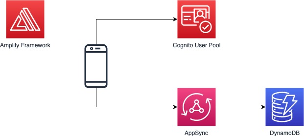
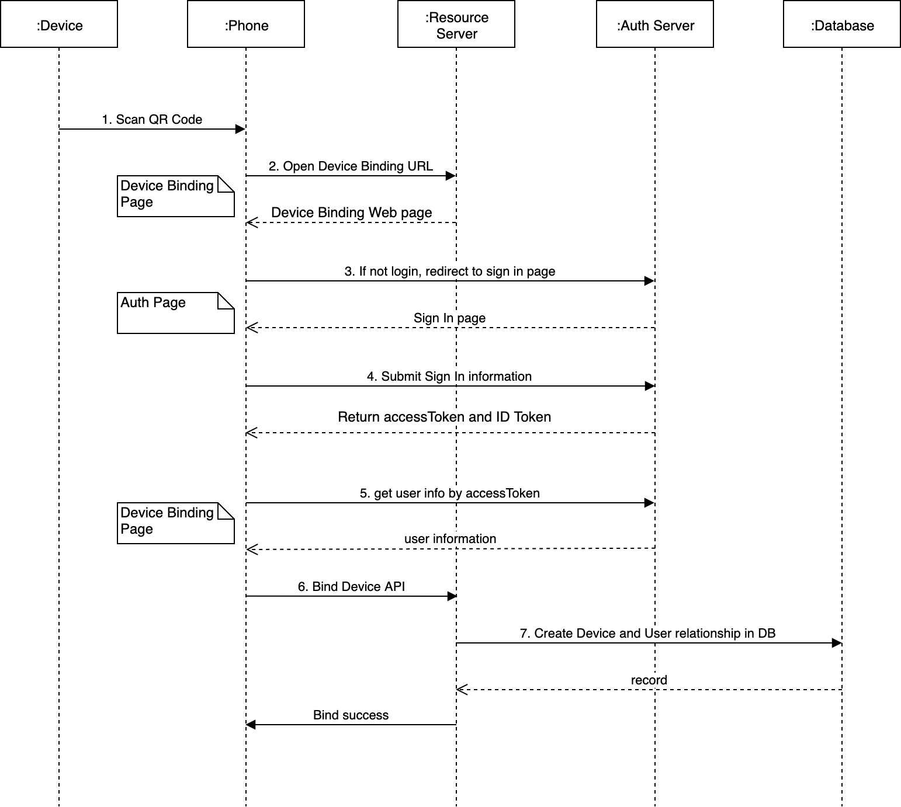
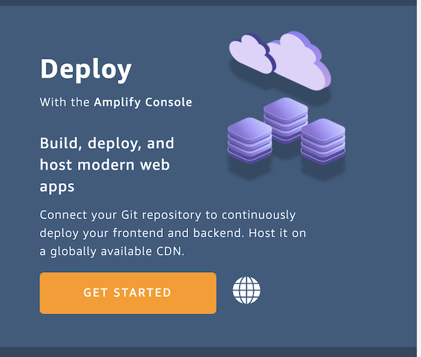
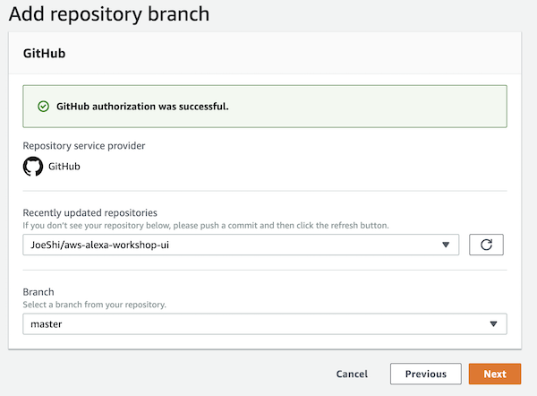
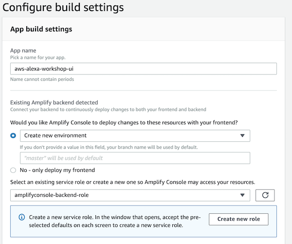
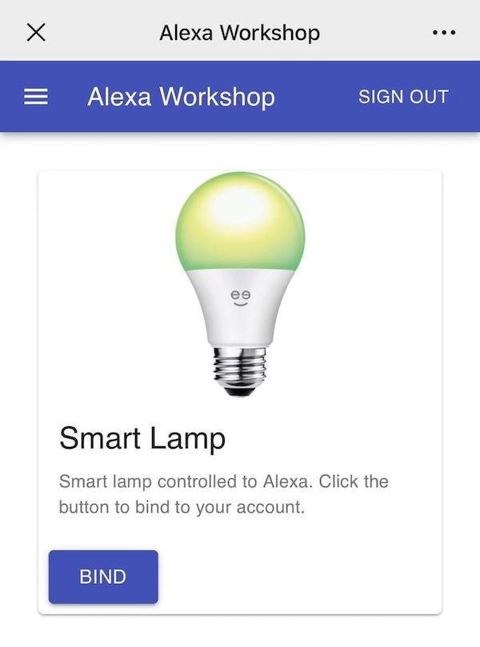

# AWS Alexa Workshop UI

This web application is part of [AWS Alexa Workshop Smart Home](https://github.com/lab798/aws-alexa-workshop-smarthome). It is used to bind devices to users in [Amazon Cognito User Pools](https://docs.aws.amazon.com/cognito/latest/developerguide/cognito-user-identity-pools.html).

The web application is built by [AWS Amplify](https://aws-amplify.github.io/). The following is the architect:

When bind a device to a user, it will invoke the API and create an record in DynamoDB. When 
your device cloud receive a [Alexa.Discovery](https://developer.amazon.com/docs/device-apis/alexa-discovery.html)
directive, your Lambda should retrieve from this DynamoDB table and return to Alexa.

The following flow chart describes a proposed design of how to bind physical device to users.

For a physical device, a serial number is usually being used to uniquely identify a device.
In this proposal, the serial number has been encoded into a QR code together with a link to a 
web page on which customers can bind their devices. The QR Code is shipped with the device.

1. Customer scan the QR code with their mobile phone
1. A web page being rendered on the phone
1. Redirect to the login page (skip to step )
1. Submit login information and get `accessToken` and `idToken`
1. Get user profile using `accessToken`
1. Invoke device binding API
1. Create device and user relationship in database

The Alexa does not have any requirement for creating the relationship between devices and users.
You can always design your own work flow. 

Once the Alexa backend server receives the [Alexa.Discovery](https://developer.amazon.com/docs/device-apis/alexa-discovery.html),
the server can retrieve device information from the database and return to Alexa.

## How to Run

This is a [modern web application](https://docs.aws.amazon.com/amplify/latest/userguide/welcome.html#what-are-modern-web-applications),
thus the easiest way for deployment is [AWS Amplify Console](https://docs.aws.amazon.com/amplify/latest/userguide/welcome.html).

### Deployment to Amplify Console

1. Git push your code to **GitHub**, **BitBucket**, **GitLab** or **CodeCommit**. You can fork this repo on GitHub.
1. Open **Amplify Console** in AWS Console, click **Get started** in **Deploy** session

1. Choose the Git repo provider and select **Continue**
1. Choose the repo and branch, select **Next**

1. Input **App name**
1. Create a new environment, input the **environment name** of leave it as default
1. Select or create a new service role, and click **Next**

1. Click **Save and deploy**

Wait for the deployment to be finished. You will be see the URL for the web application.

### Open the Web

Open `http://<amplify-app-link>/?deviceId=xxxxxx`.

You will asked to registered an account if you don't have any. 
In this application, you should input **email** address as your username.

Once you login, the browser will be navigated the device binding page. Click
the **Bind** button to link the device to your account.

## Development

You will ONLY need to run this if you would like to develop locally.

In this application, **Yarn** and **node.js** are used to build the application. 
Please install the [Yarn](https://yarnpkg.com/en/) and [node.js](https://nodejs.org/en/). 
The easiest way to install nodejs is [NVM](https://github.com/nvm-sh/nvm).

The backend is provisioned via [AWS Amplify CLI](https://github.com/aws-amplify/amplify-cli#install-the-cli). 
The easiest way to install is via **npm**. If you install nodejs via NVM, it will come with **npm**.

1. Init the backend. Run `amplify init`, enter **dev** for environment name
1. Choose your **default editor** and **AWS profile**. Wait for the initialization finished

1. Run `amplify push` and type **Yes** when asked to confirm
1. Click **Enter** button to keep the all the rest default settings

1. Run `yarn install` to install dependencies
1. Run `yarn start` to start the web application

Open [http://localhost:3000/?deviceId=xxxxxxxx](http://localhost:3000/?deviceId=xxxxxxxx) to view it in the browser.

If you are the first time to run the web application. You should click the **Create account** button to create an account.
